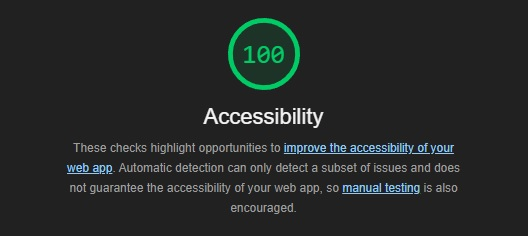

# city explorer

**Author**: Kendra McDaniels
**Version**: 1.0.0

## Overview

Application takes in a user input for a city and then outputs the longitude and latitude along with a map by using LocationIQ. The application also utilizes a custom server that handles two additional API, themoviedb and weatherbit, to get the weather for the location the user has input as well as any movies with the location in the title.

## Getting Started

API Key for LocationIQ required

## Architecture

Language: Javascript
Also using React, Bootstrap, and a custom API server
Utilizing LocationIQ

### Lighthouse

## Change Log

### lab6

1.Set up your React repository & API keys

Estimate of time needed to complete: 30min

Start time: 4:15

Finish time: 5:30

Actual time needed to complete: 1hr 15min

2.Locations
Estimate of time needed to complete: 1hr 30min

Start time: 10:00

Finish time: 11:30

Actual time needed to complete: 1hr 30min

3.Map
Estimate of time needed to complete: 30min

Start time: 11:30

Finish time: 11:50

Actual time needed to complete: 20min

4.Error
Estimate of time needed to complete: 10min

Start time: 11:50

Finish time: 12:00

Actual time needed to complete: 10min